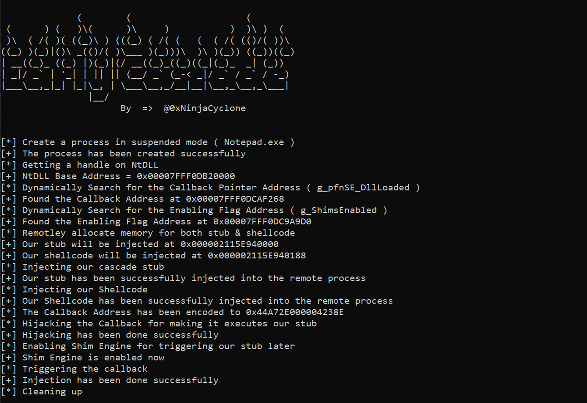

<h1 align="center">EarlyCascade</h1>

  

> It's a modern and stealthy process injection technique was discovered by [Outflank](https://www.outflank.nl/) that involves injecting and executing code in the early stages of process creation before loading EDRs for their user mode detection measures. EarlyCascade technique forces enabling the Shim engine, allowing to hijack a Shim engine callback.

## About the proof-of-concept
1. Creating a process in suspended mode.
2. Dynamically locating the addresses of enabling flag and callback.
3. Remotely allocating memory for our stub and shellcode.
4. Injecting the stub and shellcode into the target process.
5. Force the shim engine to be enabled.
6. Hijacking a shim engine callback.
7. Triggering the callback by resuming the process thread.

At this point, the stub gets executed, and does the following:
1. Disrupting the initialization of detection measures.
2. Disabling the Shim engine to avoid crash.
3. Queuing an Asynchronous Procedure Call (APC) that executes the shellcode later.

## References
- [Introducing Early Cascade Injection: From Windows Process Creation to Stealthy Injection](https://www.outflank.nl/blog/2024/10/15/introducing-early-cascade-injection-from-windows-process-creation-to-stealthy-injection/)
